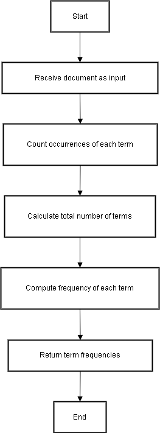
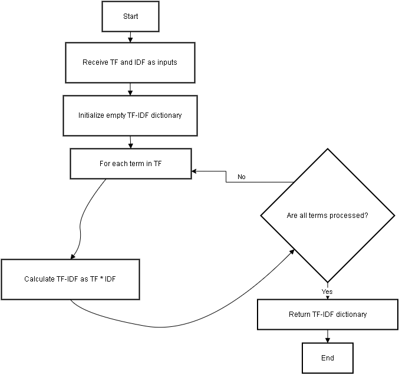
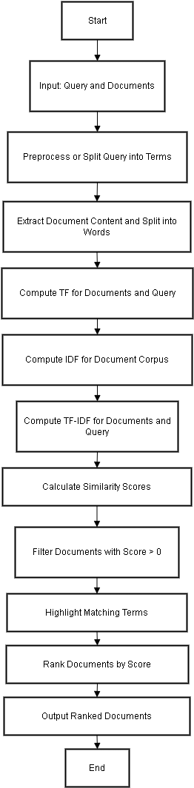

# Document Ranking Project

This project is a document ranking system that uses TF-IDF (Term Frequency-Inverse Document Frequency) and cosine similarity to rank documents based on a query. The project is implemented in Python and uses various libraries for text processing and document handling.

## Setup

To set up the project, follow these steps:

1. **Clone the repository:**
   ```sh
   git clone https://github.com/KhadimHussainDev/TF-IDF-base-Document-Ranking-System
   cd doc_ranking_project
   ```

2. **Create a virtual environment:**
   ```sh
   python -m venv document_ranking_env
   ```

3. **Activate the virtual environment:**
   - On Windows:
     ```sh
     document_ranking_env\Scripts\activate
     ```
   - On macOS/Linux:
     ```sh
     source document_ranking_env/bin/activate
     ```

4. **Install the required dependencies:**
   ```sh
   pip install -r requirements.txt
   ```

5. **Run the project:**
   ```sh
   python manage.py runserver
   ```

## Code Explanation

The main logic for document ranking is implemented in the `utils.py` file. Below are the key functions used in the ranking process:

### `compute_tf`

The `compute_tf` function calculates the term frequency (TF) for each term in a document. TF is the ratio of the number of times a term appears in a document to the total number of terms in the document.

```python
def compute_tf(document):
    tf = Counter(document)
    total_terms = len(document)
    for term in tf:
        tf[term] = tf[term] / total_terms
    return tf
```


### `compute_idf`

The `compute_idf` function calculates the inverse document frequency (IDF) for each term in the corpus. IDF is a measure of how important a term is in the entire corpus. It is calculated as the logarithm of the ratio of the total number of documents to the number of documents containing the term.

```python
def compute_idf(documents):
    idf = {}
    total_documents = len(documents)
    all_terms = set(term for doc in documents for term in doc)
    for term in all_terms:
        containing_docs = sum(1 for doc in documents if term in doc)
        idf[term] = math.log(total_documents / (1 + containing_docs))
    return idf
```
.png)

### `compute_tfidf`

The `compute_tfidf` function calculates the TF-IDF score for each term in a document. TF-IDF is the product of the term frequency and the inverse document frequency.

```python
def compute_tfidf(tf, idf):
    tfidf = {}
    for term, tf_value in tf.items():
        tfidf[term] = tf_value * idf.get(term, 0)
    return tfidf
```



### `cosine_similarity`

The `cosine_similarity` function calculates the cosine similarity between two TF-IDF vectors. Cosine similarity is a measure of similarity between two vectors, calculated as the dot product of the vectors divided by the product of their magnitudes.

```python
def cosine_similarity(doc_tfidf, query_tfidf):
    dot_product = sum(doc_tfidf.get(term, 0) * query_tfidf.get(term, 0) for term in query_tfidf)
    doc_norm = math.sqrt(sum(value ** 2 for value in doc_tfidf.values()))
    query_norm = math.sqrt(sum(value ** 2 for value in query_tfidf.values()))
    if doc_norm == 0 or query_norm == 0:
        return 0.0
    return dot_product / (doc_norm * query_norm)
```

These functions are used together in the `search_documents_tfidf` function to rank documents based on a query. The documents are then sorted by their similarity scores in descending order.


## `Complete Flow`



## License

This project is licensed under the MIT License. See the LICENSE file for details.