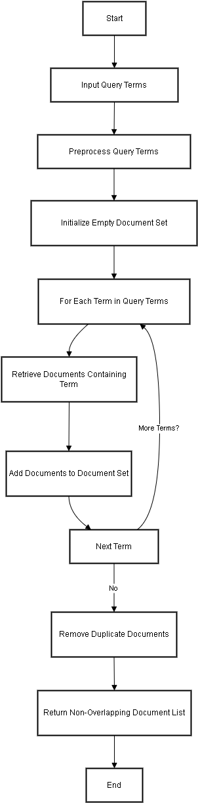

# Information Retrieval Models

This project implements three information retrieval models: Probabilistic Retrieval Model, Non-Overlapped List Model, and Proximal Nodes Model. The project is built using Django and includes preprocessing, document scoring, and retrieval functionalities.

## Table of Contents
- [Installation](#installation)
- [Usage](#usage)
- [Models](#models)
  - [Probabilistic Retrieval Model](#probabilistic-retrieval-model)
  - [Non-Overlapped List Model](#non-overlapped-list-model)
  - [Proximal Nodes Model](#proximal-nodes-model)
- [Code Explanation](#code-explanation)
  - [Views](#views)
  - [Utils](#utils)
- [License](#license)

## Installation

1. Clone the repository:
    ```sh
    git clone https://github.com/KhadimHussainDev/Ir-retrieval-models
    cd Ir-retrieval-models
    ```

2. Install the required packages:
    ```sh
    pip install -r requirements.txt
    ```

3. Apply migrations:
    ```sh
    python manage.py migrate
    ```

4. Run the development server:
    ```sh
    python manage.py runserver
    ```

## Usage

Navigate to `http://127.0.0.1:8000/retrieval` in your web browser to access the search interface. You can use the following endpoints:
- `/search/` for Probabilistic Retrieval Model
- `/search_non_overlap/` for Non-Overlapped List Model
- `/search_proximal_nodes/` for Proximal Nodes Model

## Models

### Probabilistic Retrieval Model

The Probabilistic Retrieval Model uses the Binary Independence Model (BIM) to score and rank documents based on their relevance to the query.

### Non-Overlapped List Model

The Non-Overlapped List Model retrieves documents that contain either of the specified terms without overlapping results.

### Proximal Nodes Model

The Proximal Nodes Model retrieves documents that are connected to specified proximal nodes in a network graph.

## Code Explanation

### Views

The `views.py` file contains the main logic for handling search requests and rendering results.

#### Probabilistic Retrieval Model

```python
def search_documents(request):
    query = request.GET.get('query', '')
    results = []
    if query:
        query_terms = preprocess_text(query)
        all_terms = list(set(term for doc in Document.objects.all() for term in preprocess_text(doc.content)))
        query_vector = create_binary_vector(query_terms, all_terms)

        for doc in Document.objects.all():
            doc_vector = create_binary_vector(preprocess_text(doc.content), all_terms)
            score = np.dot(query_vector, doc_vector) / (np.linalg.norm(query_vector) * np.linalg.norm(doc_vector))
            results.append({'document': doc, 'score': score})

        results = sorted(results, key=lambda x: x['score'], reverse=True)[:5]

    return render(request, 'retrieval/search.html', {'query': query, 'results': results})
```

**Explanation:**
- `query = request.GET.get('query', '')`: Retrieves the search query from the request.
- `query_terms = preprocess_text(query)`: Preprocesses the query to extract terms.
- `all_terms = list(set(term for doc in Document.objects.all() for term in preprocess_text(doc.content)))`: Collects all unique terms from the document collection.
- `query_vector = create_binary_vector(query_terms, all_terms)`: Creates a binary vector for the query.
- The loop iterates over all documents, creating a binary vector for each document and calculating the similarity score using the dot product and cosine similarity.
- `results = sorted(results, key=lambda x: x['score'], reverse=True)[:5]`: Sorts the results by score and selects the top 5.
- `return render(request, 'retrieval/search.html', {'query': query, 'results': results})`: Renders the search results.

.png)
#### `Generating Query Vector`
.png)
#### `Calculating Relevance Score`
.png)
#### Non-Overlapped List Model

```python
def search_non_overlapping_documents(request):
    query = request.GET.get('query', '')
    results = []
    if query:
        terms = preprocess_text(query)
        results = get_non_overlapping_documents(terms)

    return render(request, 'retrieval/search_non_overlap.html', {'query': query, 'results': results})
```

**Explanation:**
- `query = request.GET.get('query', '')`: Retrieves the search query from the request.
- `terms = preprocess_text(query)`: Preprocesses the query to extract terms.
- `results = get_non_overlapping_documents(terms)`: Retrieves documents that contain any of the terms without overlapping results.
- `return render(request, 'retrieval/search_non_overlap.html', {'query': query, 'results': results})`: Renders the search results.

#### Proximal Nodes Model

```python
def search_proximal_nodes(request):
    query = request.GET.get('query', '')
    results = []
    if query:
        preprocess_and_build_graph()
        terms = preprocess_text(query)
        results = document_graph.get_connected_documents(terms)

    return render(request, 'retrieval/search_proximal_nodes.html', {'query': query, 'results': results})
```

**Explanation:**
- `query = request.GET.get('query', '')`: Retrieves the search query from the request.
- `preprocess_and_build_graph()`: Builds or updates the document graph.
- `terms = preprocess_text(query)`: Preprocesses the query to extract terms.
- `results = document_graph.get_connected_documents(terms)`: Retrieves documents connected to the query terms in the graph.
- `return render(request, 'retrieval/search_proximal_nodes.html', {'query': query, 'results': results})`: Renders the search results.


### Utils

The `utils.py` file contains helper functions for preprocessing text, creating binary vectors, and building the document graph.

#### Preprocessing Text

```python
def preprocess_text(text):
    words = re.findall(r'\b\w+\b', text.lower())
    stop_words = set(stopwords.words('english'))
    words = [word for word in words if word not in stop_words]
    stemmer = PorterStemmer()
    words = [stemmer.stem(word) for word in words]
    return words
```

**Explanation:**
- `words = re.findall(r'\b\w+\b', text.lower())`: Tokenizes the text into words.
- `stop_words = set(stopwords.words('english'))`: Retrieves a set of English stop words.
- `words = [word for word in words if word not in stop_words]`: Removes stop words from the tokenized words.
- `stemmer = PorterStemmer()`: Initializes a Porter stemmer.
- `words = [stemmer.stem(word) for word in words]`: Applies stemming to the words.
- `return words`: Returns the preprocessed words.

#### Creating Binary Vectors

```python
def create_binary_vector(doc_terms, all_terms):
    return [1 if term in doc_terms else 0 for term in all_terms]
```

**Explanation:**
- `return [1 if term in doc_terms else 0 for term in all_terms]`: Creates a binary vector where each element is 1 if the term is present in the document terms, otherwise 0.

#### Building Document Graph

```python
class DocumentGraph:
    def __init__(self):
        self.graph = defaultdict(list)

    def add_edge(self, term, document):
        self.graph[term].append(document)

    def get_connected_documents(self, terms):
        connected_documents = set()
        for term in terms:
            if term in self.graph:
                connected_documents.update(self.graph[term])
        return list(connected_documents)

document_graph = DocumentGraph()
is_graph_built = False

def preprocess_and_build_graph():
    global is_graph_built
    if not is_graph_built:
        document_graph.graph.clear()
        for doc in Document.objects.all():
            content_terms = preprocess_text(doc.content)
            for term in content_terms:
                document_graph.add_edge(term, doc)
        is_graph_built = True
```

**Explanation:**
- `class DocumentGraph`: Defines a class for the document graph.
- `self.graph = defaultdict(list)`: Initializes the graph as a defaultdict of lists.
- `def add_edge(self, term, document)`: Adds an edge between a term and a document.
- `def get_connected_documents(self, terms)`: Retrieves documents connected to the given terms.
- `document_graph = DocumentGraph()`: Creates a global instance of the document graph.
- `is_graph_built = False`: Initializes a flag to check if the graph is built.
- `def preprocess_and_build_graph()`: Preprocesses documents and builds the graph if it is not already built.
.png)

## License

This project is licensed under the MIT License. See the [LICENSE](LICENSE) file for details.
