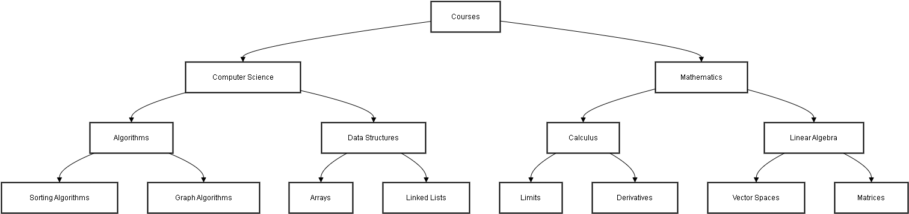

# Educational Platform for Courses, Subjects, and Topics

This project is an educational platform that allows users to navigate through courses, subjects, and topics. It implements both the Structure Guided Browsing and Hypertext Model architectures to enhance user experience and information retrieval.

## Table of Contents
- [Overview](#overview)
- [Features](#features)
- [Installation](#installation)
- [Usage](#usage)
- [Code Explanation](#code-explanation)
- [Structure Diagram](#structure-diagram)
- [Contributing](#contributing)
- [License](#license)

## Overview
This platform is designed to help users navigate through educational content in a structured and intuitive manner. It uses a hierarchical structure to organize courses, subjects, and topics, and provides hyperlinks to related content for easy navigation.

## Features
- Structure Guided Browsing: Hierarchical navigation through courses, subjects, and topics.
- Hypertext Model: Hyperlinks between related content.
- Responsive design for various screen sizes.


## Installation
1. Clone the repository:
    ```sh
    git https://github.com/KhadimHussainDev/structure_browsing-and-hypertext-model
    ```
2. Navigate to the project directory:
    ```sh
    cd structure_browsing-and-hypertext-model
    ```
3. Install the required dependencies:
    ```sh
    pip install -r requirements.txt
    ```
4. Run the Django development server:
    ```sh
    python manage.py runserver
    ```

## Usage
1. Open your web browser and navigate to `http://127.0.0.1:8000/`.
2. Browse through the available courses, subjects, and topics.
4. Click on hyperlinks to navigate between related content.

## Code Explanation

### Models
The models define the structure of the database and the relationships between courses, subjects, and topics.

```python
from django.db import models

class Course(models.Model):
    name = models.CharField(max_length=200)
    description = models.TextField()

    def __str__(self):
        return self.name

class Subject(models.Model):
    course = models.ForeignKey(Course, on_delete=models.CASCADE, related_name="subjects")
    name = models.CharField(max_length=200)
    description = models.TextField()

    def __str__(self):
        return self.name

class Topic(models.Model):
    subject = models.ForeignKey(Subject, on_delete=models.CASCADE, related_name="topics")
    name = models.CharField(max_length=200)
    content = models.TextField()

    def __str__(self):
        return self.name
```

### Templates
The templates define the HTML structure and layout of the web pages. They use Django template tags to dynamically generate content.

#### `course_list.html`
Displays a list of available courses.

```html

<!DOCTYPE html>
<html lang="en">
<head>
    <meta charset="UTF-8">
    <meta name="viewport" content="width=device-width, initial-scale=1.0">
    <title>Courses</title>
    <link rel="stylesheet" href="">
</head>
<body>
    <header>
        <h1>Available Courses</h1>
    </header>
    <main>
        <ul>
            
            <li>
                <a href="">{{ course.name }}</a>
                <p>{{ course.description }}</p>
            </li>
            
        </ul>
    </main>
</body>
</html>
```

#### `course_detail.html`
Displays the details of a selected course and its subjects.

```html

<!DOCTYPE html>
<html lang="en">
<head>
    <meta charset="UTF-8">
    <meta name="viewport" content="width=device-width, initial-scale=1.0">
    <title>{{ course.name }}</title>
    <link rel="stylesheet" href="">
</head>
<body>
    <header>
        <h1>{{ course.name }}</h1>
        <p>{{ course.description }}</p>
    </header>
    <main>
        <button onclick="history.back()">Go Back</button>
        <h2>Subjects</h2>
        <ul>
            
            <li>
                <a href="">{{ subject.name }}</a>
                <p>{{ subject.description }}</p>
            </li>
            
        </ul>
    </main>
    <footer>
        <a href="">Back to Courses</a>
    </footer>
</body>
</html>
```

#### `subject_detail.html`
Displays the details of a selected subject and its topics.

```html

<!DOCTYPE html>
<html lang="en">
<head>
    <meta charset="UTF-8">
    <meta name="viewport" content="width=device-width, initial-scale=1.0">
    <title>{{ subject.name }}</title>
    <link rel="stylesheet" href="">
</head>
<body>
    <header>
        <h1>{{ subject.name }}</h1>
        <p>{{ subject.description }}</p>
    </header>
    <main>
        <button onclick="history.back()">Go Back</button>
        <h2>Topics</h2>
        <ul>
            
            <li>
                <h3>{{ topic.name }}</h3>
                <p>{{ topic.content }}</p>
            </li>
            
        </ul>
    </main>
    <footer>
        <a href="">Back to {{ subject.course.name }}</a>
    </footer>
</body>
</html>
```
## Structure Diagram



## Contributing
Contributions are welcome! Please open an issue or submit a pull request for any improvements or bug fixes.

## License
This project is licensed under the MIT License. See the [LICENSE](LICENSE) file for details.
